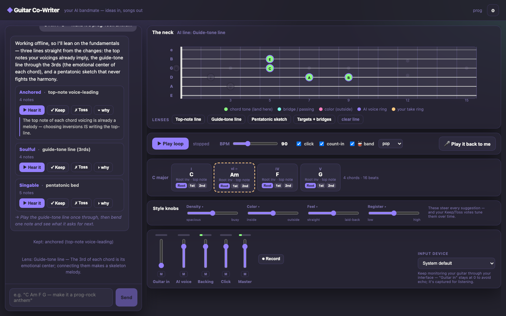

# 🎸 Guitar Co-Writer

**Your AI bandmate** — an intent-driven co-writing tool for the intermediate guitarist who has
ideas but can't quite get them onto paper.



Tell it what you've got and where you want to take it:

> *"C Am F G — make it a prog-rock anthem"*
> *"neo-soul in A minor at 85 bpm, give me something to react to"*

The co-writer thinks out loud, and every idea arrives three ways at once:
**words** (the reasoning, tied to chord tones and degrees), **sound** (its own
Rhodes-like voice over your looping progression), and **shape** (role-colored dots on the neck).

## The heart: propose → play it back → it reacts

1. The AI proposes a melody line — you see it on the fretboard and hear it in its own voice.
2. Hit **🎤 Play it back to me** and play the line back *your* way on real guitar.
3. The app hears you (monophonic pitch tracking), **diffs your take against the proposal**
   — flatted a third? delayed the entrance? added a note? — and reacts to the difference
   as creative intent: *"you flatted that E — bluesier. Want me to lean into it?"*

## What's inside

- **Correct music theory engine** — ported from [Fretboard Explorer](https://github.com/aaron-mendelson/fretboard-explorer)
  (triads + drop-2 sevenths across string sets, enharmonic spelling, min-span voicings) and extended with
  scales/modes, diatonic harmony, chord-scale color logic (that free Lydian ♯11 on the IV chord), and
  melodic "lenses": top-note voice-leading, guide-tone lines, pentatonic beds, chord-tone targets + bridge notes.
- **Inversions are the melody lever** — each chord chip has inversion buttons; the top note of the
  voicing *is* the topline. Roman numerals shown for everything.
- **A real transport** — lookahead Web Audio scheduler, BPM, count-in, click, one-tap
  *loop-just-this-chord* (tap a chord's name).
- **A band** — toggle drums/bass/keys generated *from your exact chords* (rock/pop/ballad/funk),
  never a black box.
- **A small mixer** — Guitar-in / AI voice / Backing / Click faders with meters, mute, input-device
  picker, and one-button take recording. Keep monitoring your guitar through your interface
  (zero latency); the app captures it for listening.
- **Taste that learns you** — every Keep/Toss is remembered and steers future suggestions.
- **Works without a key** — the built-in lenses always produce real, playable options; add an
  Anthropic API key (⚙ Settings, stays in your browser) for the full conversational bandmate.

## Run it

```bash
npm install
npm run dev
```

Optional: paste an Anthropic API key in ⚙ Settings (stored in `localStorage`, only ever sent to
Anthropic's API from your browser).

## Tests

```bash
npx vitest run          # engine, listening, AI sanitization — no network
node scripts/smoke.mjs  # end-to-end browser smoke (needs `npm run dev` on :5199)
```

## Architecture

```
src/engine/    theory (pure), progressions, note events, melodic lenses
src/audio/     context+bus, Karplus-Strong guitar, SoundFont AI voice,
               lookahead transport, mixer/capture, backing arrangements
src/listen/    monophonic pitch tracking → quantize → musical diff
src/ai/        intent parsing (HAVE/WANT/VIBE), co-writer turns (engine-sanitized),
               taste profile, phrase bank
src/ui/        chat, fretboard (two overlaid voices), timeline, transport, mixer
```

The AI's note events are **never trusted**: every returned melody is re-classified against the
engine (chord tones vs. passing vs. outside), clamped, made monophonic, and placed on the neck
before you see it.

## License

MIT
